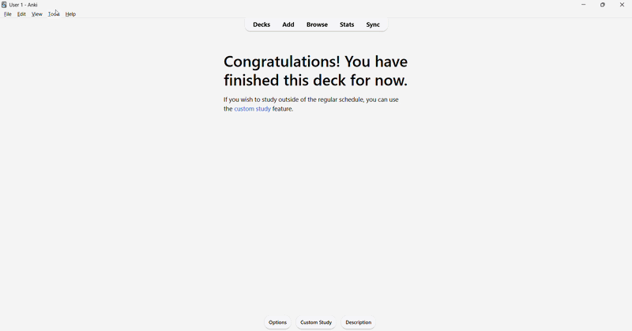
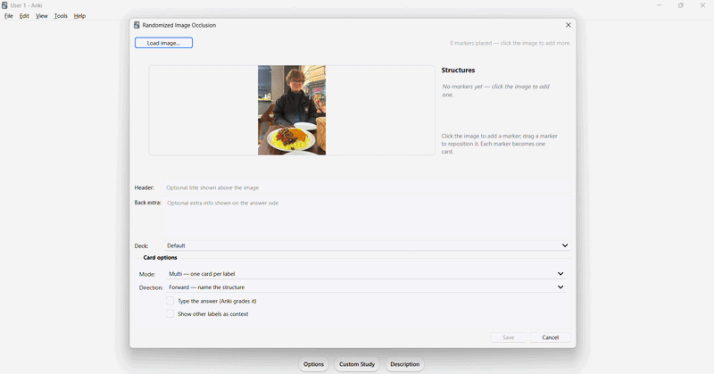
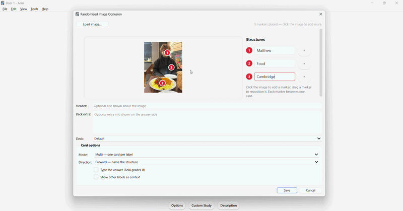
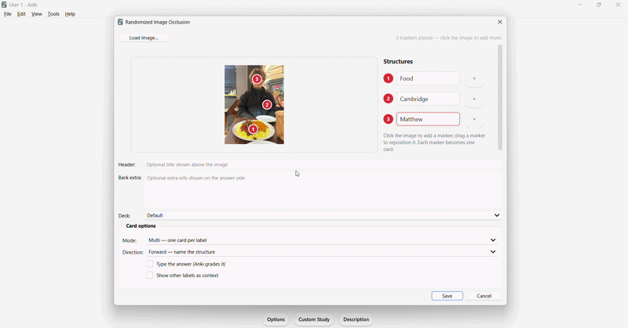
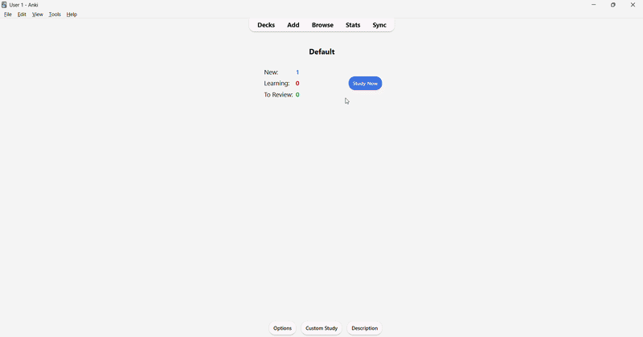

# Randomized Image Occlusion

*Anki image occlusion — but you can't cheat.*

An Anki add-on for studying labelled diagrams: anatomy cross-sections, the
brachial plexus, histology slides, bones, ECGs, etc.

> **Built for Ezra** - a medical student at the University of Glasgow, whose idea
> and request this whole thing grew out of. 💛 See [Thanks](#thanks).

---

## The problem it fixes

Normal image occlusion hides a label on a diagram and asks you to recall it. It
works - until it doesn't. Because the hidden box always sits in the **same spot**,
your brain quietly starts taking a shortcut: you remember *"the box in the
top-left is the aorta"* from **where it is**, not because you actually recognise
the aorta.

That's spatial memory doing your revision for you. It feels like you know the
diagram. Then the exam shows the same structure from a slightly different angle,
and it's gone.

## What it does instead

Every single time a card comes up, this add-on drops the answer box in a
**random place** on the image and draws an arrow from the box to the real
structure. There's no fixed position to lean on: you have to follow the arrow
and genuinely identify what it's pointing at.

Same idea as image occlusion. Same one-click workflow. It just refuses to let you
memorise the layout instead of the material.

The shuffling is purely visual: it **never** touches Anki's scheduling or your
review history. Your stats and FSRS stay exactly as they were.

## See it in action

### Setting up the card maker

<p align="center">
  <br>
  <em>Entering the setup: navigating to the drop-down menu.</em>
</p>

### Labelling a card

<p align="center">
  <br>
  <em>Labelling a card: setting up markers for occlusion.</em>
</p>

### Moving card occlusion markers

<p align="center">
  <br>
  <em>Moving card markers: moving occlusion markers around the card.</em>
</p>

### Deleting card occlusion markers

<p align="center">
  <br>
  <em>Deleting card markers: deleting and reinstating individual occlusion markers.</em>
</p>

### Filling card occlusion metadata

<p align="center">
  <br>
  <em>Filling card metadata: filling in card occlusion metadata.</em>
</p>

### Demo test run

<p align="center">
  <br>
  <em>Reviewing a card: the prompt box lands somewhere new each time, with an arrow to the structure.</em>
</p>

## Extra study modes (optional)

You can leave everything on its sensible defaults, or turn on:

- **Type the answer** - type the structure's name and let Anki grade it, instead
  of flipping to reveal. (Note: if a label contains `::`, `{{` or `}}` — e.g. a
  C++/Rust name like `std::vector` — Anki's type grader compares against an
  escaped form, so use *reveal* or *single-card* mode for those labels.)
- **Reverse cards** - instead of *"what is this?"*, get *"where is the X?"* and
  find it. Or **both** directions per structure.
- **Context labels** - show the surrounding labels while you answer, the way
  "hide one, guess one" occlusion does.
- **Single-card mode** - put a whole diagram on **one** card that cycles through
  every label in a fresh random order each review, with a running counter.

Works in both light and dark mode, and on your phone (AnkiDroid / AnkiMobile) —
the card carries everything it needs, so it renders even where the add-on isn't
installed.

---

## Requirements

Anki **23.10 or newer** (desktop).

## How to install it

**The easy way - from AnkiWeb** (listed as **Randomized Image Occlusion**):

1. In Anki, go to **Tools → Add-ons → Get Add-ons…**.
2. Paste in the code **`1836497069`** and click **OK**.
3. Restart Anki.

You can also find the listing here:
<https://ankiweb.net/shared/info/1836497069>.

**Or install from a file** (e.g. before it finished syncing to AnkiWeb):

1. Download `randomized_occlusion.ankiaddon` from the
   [Releases page](../../releases).
2. Open Anki and go to **Tools → Add-ons → Install from file…**, then pick the
   file you just downloaded. (On most computers you can also just double-click
   the file.)
3. Restart Anki.

Either way, you'll now see **Tools → Randomized Image Occlusion…** in the menu.

## How to use it

1. Go to **Tools → Randomized Image Occlusion…**.
2. Click **Load image…** and choose your diagram.
3. Click each structure on the image to drop a numbered marker, and type its
   label. Repeat for every part you want to learn. (Drag a marker to reposition
   it; click the × in the list to remove one.)
4. *(Optional)* Add a header, some back-of-card notes, pick a deck, and choose any
   of the study modes above.
5. Click **Save**. Your cards are added to the deck.

Then just review like any other Anki cards. Each time, the prompt box lands
somewhere new with an arrow to the structure - so you're always answering *"what
is this?"*, never *"what usually goes in this corner?"*.

### From Anki's Add window

You can also make cards straight from **Add**: choose the **Randomized Image
Occlusion** note type and click the **Occlusion** button in the editor toolbar to
mark the image up on the canvas, then press Anki's **Add**. The internal fields
(Image, Structures, Ordinals, TypeAnswer) are collapsed out of the way so you
never have to touch them by hand.

### Editing a card later

Made a typo, or want to nudge a marker? Open the **Browse** window, right-click
the card, and choose **Edit with Randomized Image Occlusion**. The image and all
its markers reappear on the canvas exactly as you left them - move them, rename
them, add or remove structures, change the study mode, then **Save**. Anki
updates the card (and adds or removes cards if you changed the number of markers)
in a single undo step.

## Settings

Prefer different colours, a longer minimum arrow, or a different default mode?
Everything is adjustable under **Tools → Add-ons → Randomized Image Occlusion →
Config**. Each option is documented in
[`config.md`](src/randomized_occlusion/config.md).

---

## Thanks

This add-on exists because of **Ezra**!

## For developers

The code lives in [`src/randomized_occlusion/`](src/randomized_occlusion/). The
core logic has no dependency on Anki and is fully unit-tested; only the thin
editor and menu shells need Anki to run.

```sh
pip install -e ".[dev]"
pytest                       # Python tests (domain, config, note pipeline, fuzz)
node --test tests/js/*.test.js   # headless tests for the reviewer JS
ruff check .                 # lint
mypy                         # type-check
python build.py              # writes dist/randomized_occlusion.ankiaddon
```

The Python suite includes randomized property/fuzz tests (`test_fuzz.py`) that
hammer the note round-trip and payload invariants, and the JS suite runs the
reviewer's placement/RNG logic headlessly (Node's built-in runner, no deps).

## License

See [LICENSE](LICENSE).
